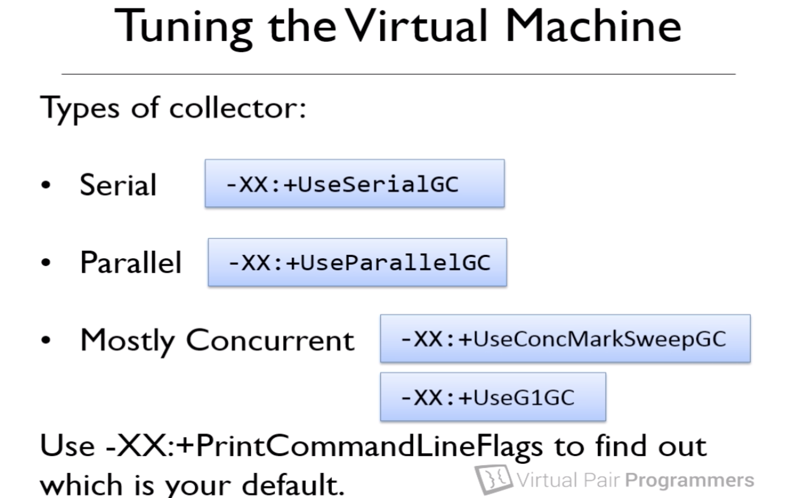

##Garbage collection


###String Pool
- VM will open a string pool
- we will only have one 'hello' in the heap and two reference variable in stack

```Java
String one = "hello";
String two = "hello";

one.equals(two); // true

String three = new Integer(76).toString();
String four = "76";
String five = new Integer(76).toString().intern();//internized
three.equals(four); // false
// because if string is converted/calculate, then it wont be reused
five.equals(four); // false
```

###Garbage eligibility
- free() in other languages
- Java avoids memory leaks by running on a virtual machine
- Adopts a garbage collection strategy
- Any object on the heap which cannot be reached through a reference from the stack is eligible for garbage collection

###System.gc()
- no guarantee that VM will run gc()

###finalize()
- cannot rely on finalize() to be called
- real use: mostly finalize() is used to warn

###Soft Leak
- an object is referenced on the stack even though it will never be used again

###GC mechanism
####Mark and Sweep
- Pause application and then Mark system check reference in the stack
- Mark those real ones to alive
- Sweep and remove those without mark

####Generation Garbage Collection
- Pause application is not usually acceptable
- a way to organize the heap
- heap is divided into young and old Generation
- new object is created in young generation
- since new objects are young generation and it mostly possible that garbage are these new objects, so the process to young generation should be very quick and this time survival objects are copied to old generation
- real model might have 8 division on young generations, young1 -> yong2 -> ... -> yong8 -> old
- use ```Visual GC```to view a soft leak
- use ```Memory Analyzer tool``` to analyze leak details

####PermGen / MetaSpace(after Java 6)
- PermGen: permanent generation
- Heap is divided into young, old, PermGen
- Java 8 removed PermGen and introduce MetaSpace(meta data of class, allocated from memory from computer)
- Java 8, heap is divided into young and old, and MetaSpace is direct from memory

####Tuning VM
- ```-Xmx``` set the max heap size
- ```Xms``` set the starting heap size
- ```-Xmx512m -Xms150m```
- ```XX:MaxPermSize=256m```
- ```-verbose:gc``` print to console when gc happen
- ```-Xmn``` set the size of the young generation ```-Xmn256m```
- ```XX:HeapDumpOnOutOfMemory``` creates a heap dump file

####GC collector

