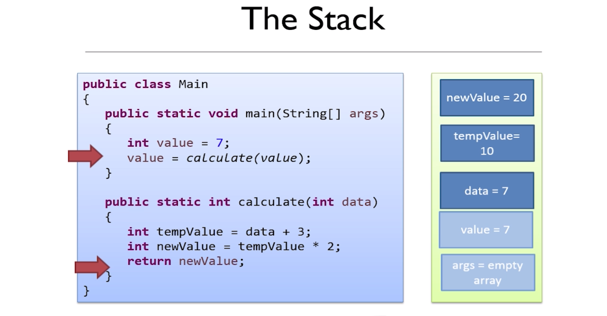
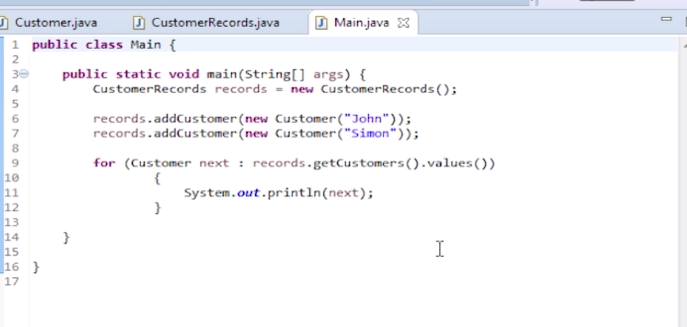

##Memory


###Stack
- First in, last out
- Every thread has its own stack
- JVM know when to destroy stack(like after one function ends)



###Heap
- all objects are stored on the heap
- object in heap that can shared across multiple threads
- variable are a reference to the objects
- local variables are stored on the stack


###Pass by value
- For Primitives, pass by value
- For objects, the Reference to the object is passed by value(we are passing the copy of pointer, so it still points to that object)


###final keyword
- final, variable can only be assigned once
- is similar to const in C
```
final Customer c= new Customer("John");
c = new Customer("Susan"); //compile error

```

###Escaping reference
- if we add ```records.clear()``` at end of this code, then it will clear the records
- it will work like this CustomerRecords is defined public instead of private, since we can direcly operate on them
- one solution is that we make this CustomerRecords directly iterable



