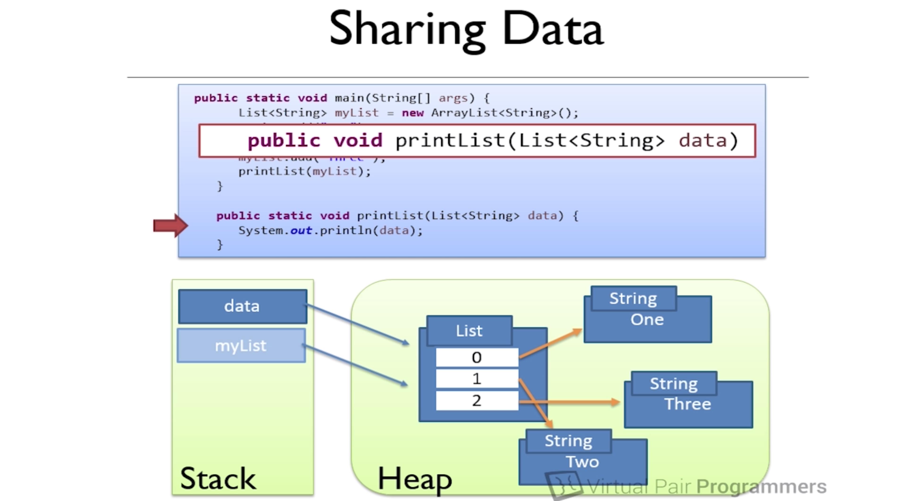

##Memory

###Stack
- First in, last out
- Every thread has its own stack
- JVM know when to destroy stack(like after one function ends)

###Heap
- all objects are stored on the heap
- object in heap that can shared across multiple threads
- variable are a reference to the objects
- local variables are stored on the stack

