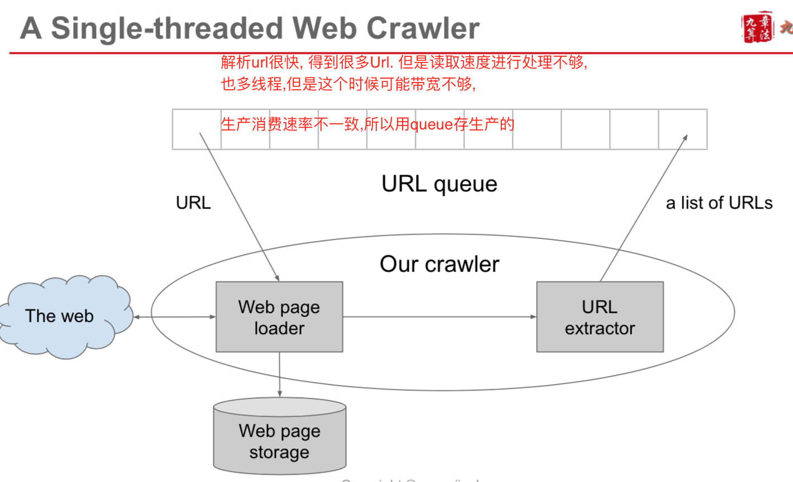
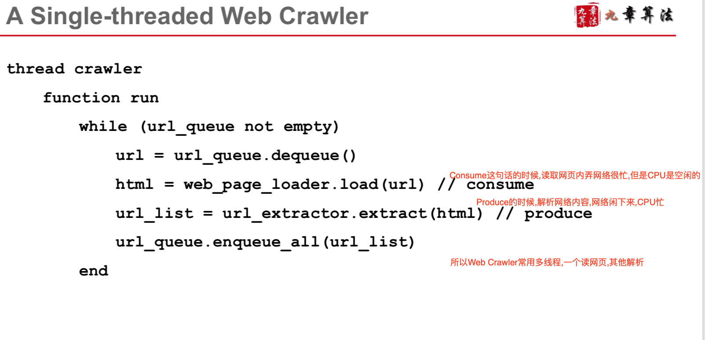
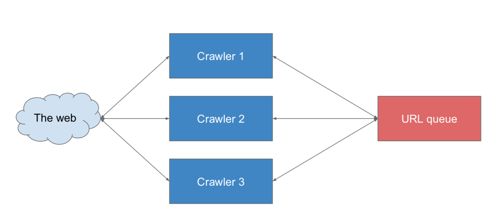
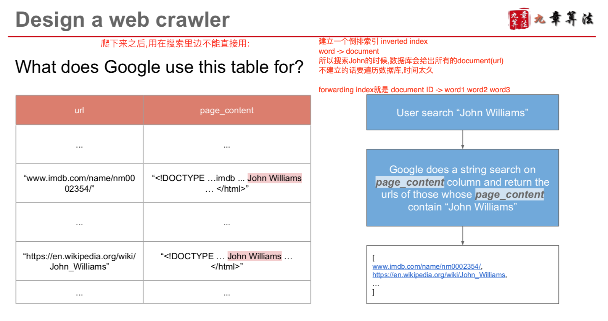
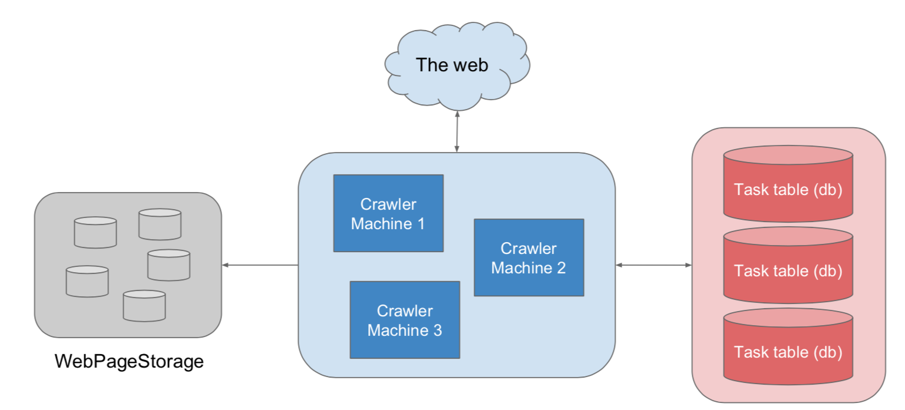

##Crawler
- For collectiing data/information from the web
- 爬的时候,就是一个有向图, url1 -> url2 -> url3/url4
- 从种子店触发,找到联通的点,BFS
- 可能碰到环形到重复的节点
- 量太大, 很有可能爆内存
- 所以既要考虑QPS,还要考虑到内存,disk

###Field related to Crawler
- multi-threading
- system design

###爬虫
- a simplistic news crawlerService
- a simplistic web crawlerService
- a single-threaded web crawler
- a multi-threaed web crawler

####simplistic news crawlerService
- given the URL of news list pages
- send HTTP request and grab content
- extract news title from news list page, 使用regular expressions

```py
Python 比如 import urllib2
request = urllib2.Request(url)
response = urllib2.urlopen(request)
page = response.read()
```
####single threaded web crawlerService
- 单线程Crawler, 用MQ, 比如Kafka, Rabit等



####multi threaded web crawlerService



###How Google search engine use crawler



###Scenario
- 1 trillion web pages, one week
- => 1.6m web pages per second
- 网页平均大小 1KB
- 那么需要10PB
- 不可能放到内存里边去做,只能放到磁盘里边
- 还有个问题,同一个网页,一个更新频繁的网站可能需要经常爬去,有的小网站需要过很多爬一次􏱲􏰌􏰕􏱛 􏰂, 这样既就需要动态实时的爬去

###Service
- Crwaler, TaskService(需要一个producer-consumer模型), StorageService




###Storage
- db to store tasks, bigtable to store web pages

###Scale
