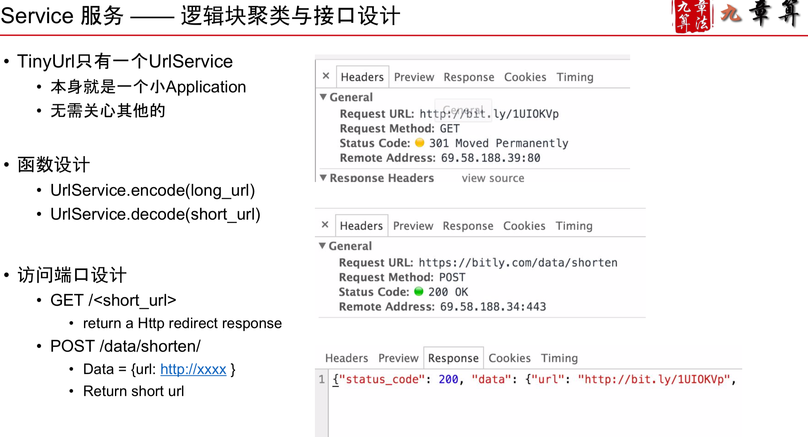
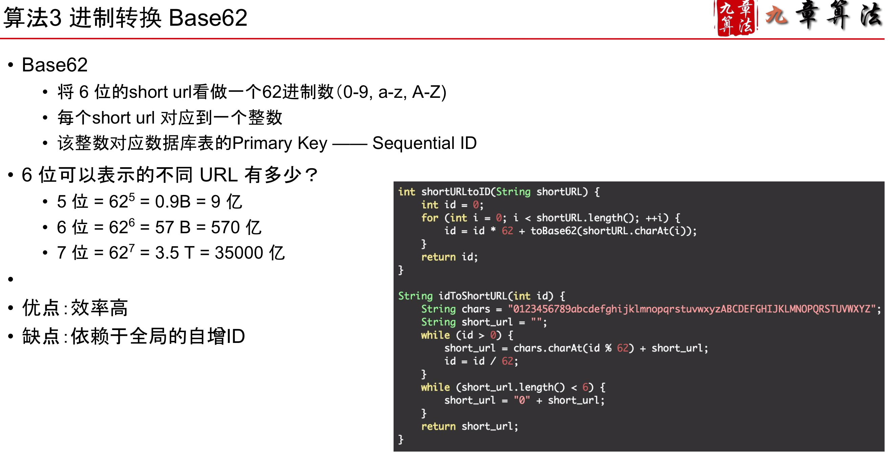
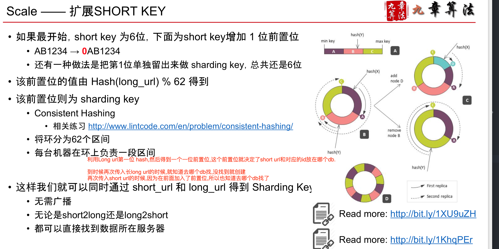
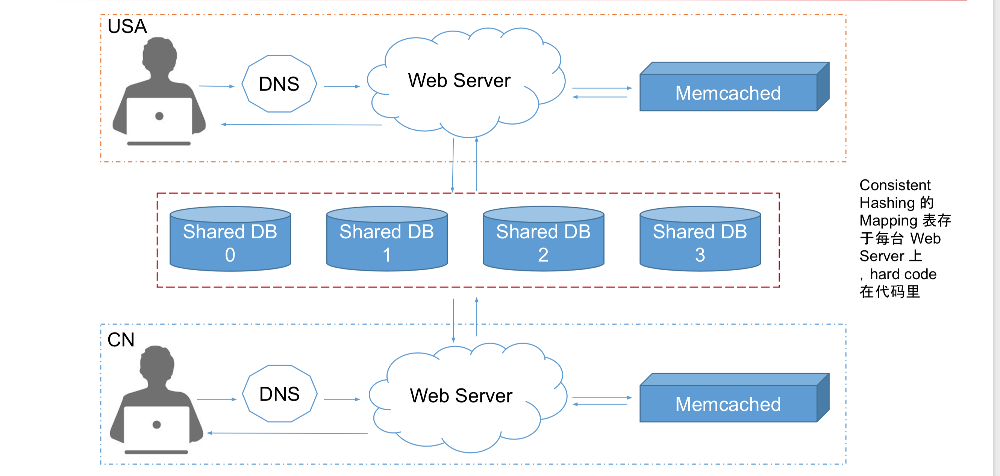
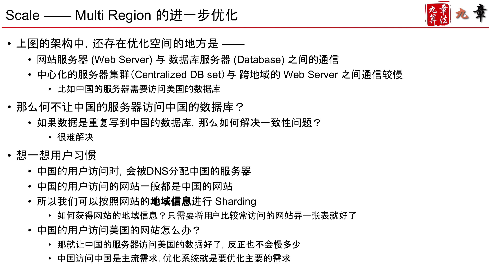
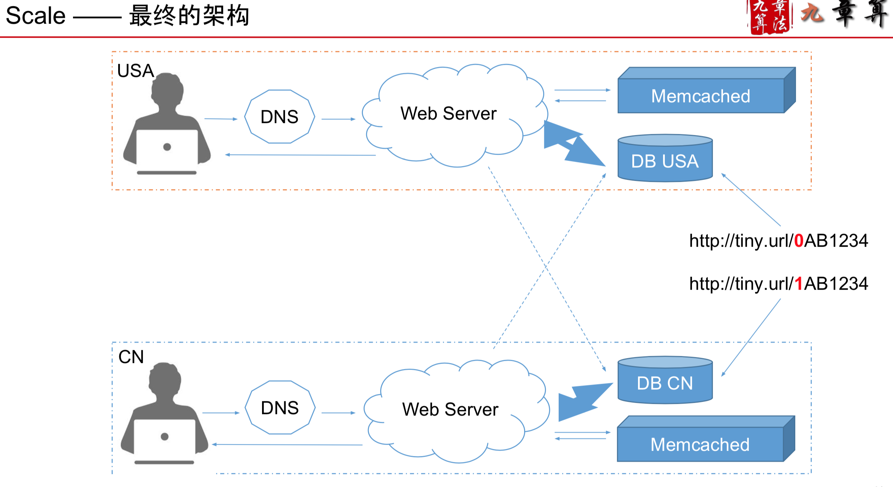

#Design Tiny URL

###Scenario
1. 根据 Long URL 生成一个 Short URL: http://www.jiuzhang.com => http://bit.ly/1UIoQB6

2. 根据Short URL 找到 Long URL进行跳转
3. 两个需要和面试官确认的问题 1)Long Url 和 Short Url 之间必须是一一对应的关系么? 2)Short Url 长时间没人用需要释放么?

```
1. 询问面试官微博日活跃用户
• 约100M
2. 推算产生一条Tiny URL的QPS
• 假设每个用户平均每天发 0.1 条带 URL 的微博
• Average Write QPS = 100M * 0.1 / 86400 ~ 100
• Peak Write QPS = 100 * 2 = 200
3. 推算点击一条Tiny URL的QPS
• 假设每个用户平均点1个Tiny URL
• Average Read QPS = 100M * 1 / 86400 ~ 1k
• Peak Read QPS = 2k
4. 推算每天产生的新的 URL 所占存储
• 100M * 0.1 ~ 10M 条
• 每一条 URL 长度平均 100 算，一共1G
• 1T 的硬盘可以用 3 年
```
###Service


###Storage
- 数据库的选择
```
是否需要支持 Transaction?——不需要。NoSQL +1
• NoSQL不支持Transaction
是否需要丰富的 SQL Query?——不需要。NoSQL +1
• NoSQL的SQL Query不是太丰富
• 也有一些NoSQL的数据库提供简单的SQL Query支持
是否想偷懒?——Tiny URL 需要写的代码并不复杂。NoSQL+1 • 大多数 Web Framework 与 SQL 数据库兼容得很好
• 用SQL比用NoSQL少写很多代码

对QPS的要求有多高?—— 经计算，2k QPS并不高，而且2k读可以用Cache，写很少。SQL +1
• NoSQL 的性能更高
对Scalability的要求有多高?—— 存储和QPS要求都不高，单机都可以搞定。SQL+1
• SQL 需要码农自己写代码来 Scale
还记得Db那节课中怎么做Sharding，Replica的么?
• NoSQL 这些都帮你做了
是否需要Sequential ID?——取决于你用什么算法
• SQL 为你提供了 auto-increment 的 Sequential ID
• 也就是1,2,3,4,5 ...
• NoSQL的ID并不是 Sequential 的
```
###算法

- 用全局自增ID,一般更常用语单机(可以在自增ID前加入一个参数,比如0ID, 1ID, 作为机器的自增ID)
- 也可以生成一个随机的shortURL,这样就不依赖于自增ID,随机的缺点是随着使用的短网址用得越来越多,会变得越来越慢
- 需要对 shortKey 和 longURL 分别建索引(index)。

```
也可以选用 NoSQL 数据库，但是需要建立两张表(大多数NoSQL数据库不支持二级索引) 以 Cassandra 为例子
第一张表:根据 Long 查询 Short
row_key=longURL, column_key=ShortURL, value=null or timestamp
第二张表:根据 Short 查询 Long
row_key=shortURL, column_key=LongURL, value=null or timestamp
```

###Scale

1. 利用缓存
```
利用缓存提􏰁(Cache Aside) • 缓存里需要存两类数据:
• long to short(生成新 short url 时需要)
• short to long(查询 short url 时需要)
```
2. 提速
```
利用地理位置信息提􏰁

优化服务器访问􏰁度
• 不同的地区，使用不同的 Web 服务器
• 通过DNS解析不同地区的用户到不同的服务器

 优化数据访问􏰁度
• 使用Centralized MySQL+Distributed Memcached
• 一个MySQL配多个Memcached，Memcached跨地区分布

```

3. 假如我们一开始估算错了，一台MySQL搞不定了

 ```
什么时候需要多台数据库服务器?
• Cache 资源不够
• 写操作越来越多
• 越来越多的请求无法通过 Cache 满足

增加多台数据库服务器可以优化什么?
• 解决“存不下”的问题 —— Storage的角度
• 解决“忙不过”的问题 —— QPS的角度
• Tiny URL 主要是什么问题?
 ```

 - Horizontal Sharding
• 用什么做Sharding Key?
• 如果用 ID，如何查询 Long Url? • 如果用Long Url，如何查询 ID?

```
用 Long URL 做 shard key
• 查询的时候，只能广播给N台数据库查询
• 并不解决降低每台机器QPS的问题
• 因为更常见是使用shortURL 去找 Long URL

用 ID 做 shard key
• 按照 ID % N(N为数据服务器个数)，来分配存储
• Short url to long url
  • 将 short url 转换为 ID
  • 根据ID找到数据库
  • 在该数据库中查询到 long url
• Long url to short url
  • 先查询:广播给 N 台数据库，查询是否存在
    • 看起来有点耗，不 过也是可行的，因 为数据库服务器不会太多
  • 再插入:如果不存在的话，获得下一个自增ID的值，插入对应数据库
```

- 或者更高级的方法


4. 目前架构


5. 继续优化


6. 最终架构


7. 再可以考虑加入新功能: Custom URL
