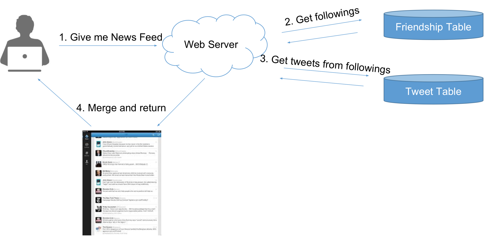
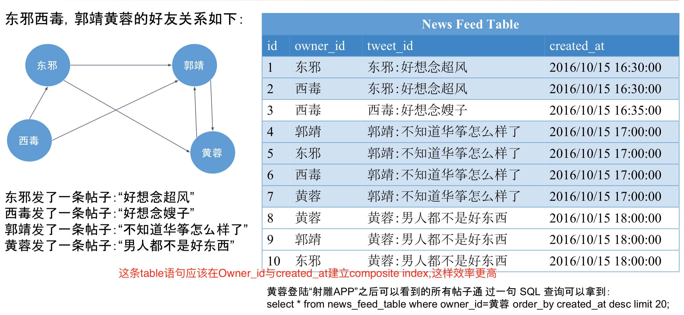
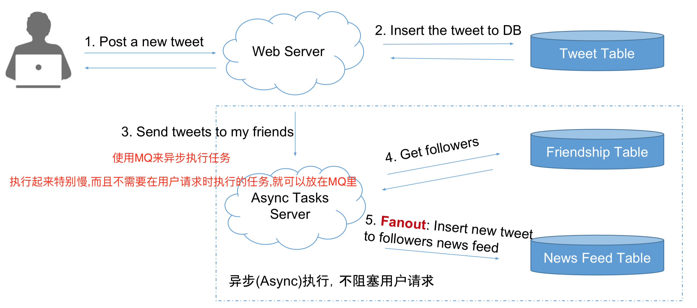

#Design Twitter / 4S Analyze

##4S分析法

###1.Scenario
- 需要设计哪些功能,设计得多牛
- Ask/Features/QPS/DAU/Interfaces

###2.Service
- 讲大系统拆分为小服务
- Split/Application/Module

###3.Storage(重点)
- 数据如何存储于访问
- Schema/Date/SQL/NoSQL/File System

###4.Scale
- 解决缺陷,处理可能遇到的问题
- Sharding/Optimize/Special case

##Design Twitter 具体
###1.Scenario
####Ask User DAU,日活跃用户

```
  并发用户 Average concurrent user = 日活跃用户 * 平均请求次数 / 86400(一天的秒数)
  150M * 60 / 86400 = 100k
  峰值Peak = Average concurrent user * (2-9)  = 300k
  快速增长的产品 Fast growing
  Max Peak = Peak * (2-9)

  Read QPS = 300k
  Write QPS = 5k 写的次数比读的次数少很多

  在用户当下请求下,一般不应该超过10次查询和修改,否则就应该重新写一下
  所以request跟query一般有1-10系数的关系
  读query 可能在 1M次数
  写query 可能在 15K
```

```
QPS 有什么用

QPS = 100 笔记本就可以
QPS = 1K 一台好的Web服务器,但是要考虑single point failure
QPS = 1M 需要1000台Web服务器集群,需要考虑挂了怎么办

一台Web Server  约承受量1K的QPS
一台SQL DB 约承受量 1K的QPS,如果JOIN和INDEX Query比较多的话,这个值会更小
一台NOSQL DB (Cassandra) 约承受量是10K的QPS
一台NOSQL DB(Memcached) 约承受量是1M的QPS

```

####列出需求功能
#####先Enumerate,再Sort,选出核心功能
- Register
- User Profile
- Upload image
- Search
- Post
- Timeline/NewsFeed
- Follow

#####再Sort,选出
- Post a tweet
- Timeline
- News NewsFeed
- Follow/Unfollow
- Register/Login

###2.Service
- 一个大系统,通过Router,就知道我们具体要去做什么
- Service是一个逻辑处理的整合
- 对同一类问题的逻辑处理就归并在同一个Service中
- 重新过一遍每个需求,为每个需求添加一个服务
- 归并相同的服务


###3.Storage
- 为每个Servie选择最佳存储结构
- 细化表单结构


- DB是对FileSystem的包装,DB基于FS
- 本身就是文件的东西,就不需要放在DB中了,比如视频,图片


(Tweet Service数据量大,也不需要支持太复杂的查询,所以用NoSQL)

####NewsFeed如何活取
- NewsFeed: 你登陆 Facebook / Twitter / 朋友圈 之后看到的信息流. 你的所有朋友发的信息的集合

#####Pull Model
- 算法:在用户查看News Feed时，获取每个好友的前100条Tweets，合并出前100条News Feed • K路归并算法 Merge K Sorted Arrays
- 复杂度分析: News Feed => 假如有N个关注对象，则为N次DB Reads的时间 + K路归并时间(可忽略)
- 为什么K路归并的时间可以忽略? Post a tweet => 1次DB Write的时间


#####Pull Model 缺陷
- N次DB Reads非常慢 且发生在用户获得News Feed的请求过程中

#####Push Model
- 算法: 为每个用户建一个List(一个NewsFeed Table)存储他的News Feed信息, 在另用户发一个Tweet之后，将该推文逐个推送到每个用户的News Feed List中
- 关键词:Fanout,逐步推送,fanout到用户News Feed List
- 用户需要查看News Feed时，只需要从该News Feed List中读取最新的100条即可
- 读复杂度分析: News Feed => 1次DB Read
- 写复杂度分析: Post a tweet => N个粉丝，需要N次DB Writes
- 但是这时候的写有个好处是可以用异步任务在后台执行，无需用户等待



