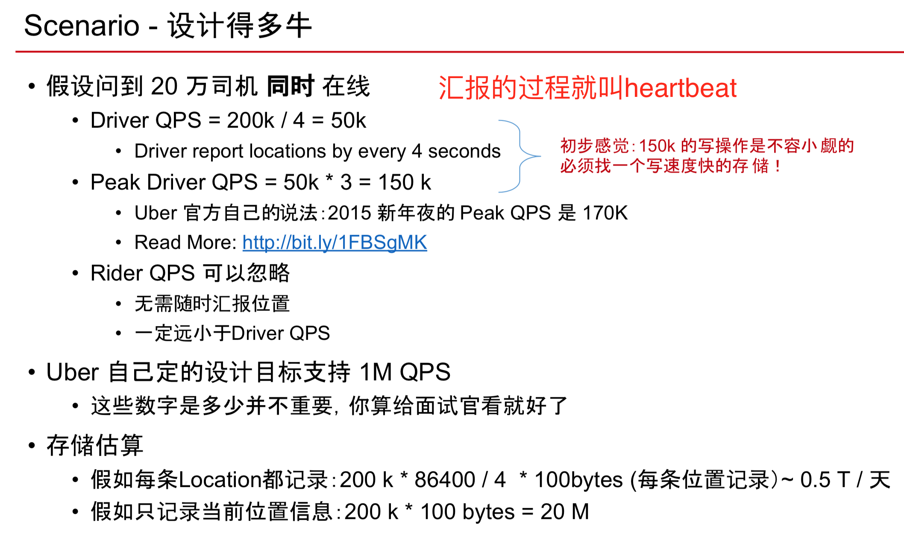

#Location Based Service

##一些各家的技术介绍


##Scenario




##Service


##Storage


##算法
####最笨的办法

```sql
SELECT * FROM Location
WHERE lat < myLat + delta
AND lat > myLat - delta
AND lng < myLng + delta
AND lng > myLng - delta;

——这个基本等同于扫描了一遍所有的数据,数据量太庞大了

也不可能先把位置进行了排序,排序的时间太久了

而且使用了两个column 的 range query
```

####Google S2
• [Read more](http://bit.ly/1WgMpSJ)
• [Hilbert Curve](http://bit.ly/1V16HRa)
• 将地址空间映射到2^64的整数
• 特性:如果空间上比较接近的两个点，对应的整数也比较接近
• Example: (-30.043800, -51.140220) → 10743750136202470315
• 更精准，库函数API丰富

####Geohash
• [Read more](http://bit.ly/1S0Qzeo)
• Peano Curve
• Base32:0-9, a-z 去掉 (a,i,l,o)
• 为什么用 base32 ? 因为刚好 25 可以用 5 位二进制表示 • 核心思路二分法
• 特性:公共前缀越长，两个点越接近
• Example: (-30.043800, -51.140220) → 6feth68y4tb0
• 比较简单，准确度差一些


##Location
