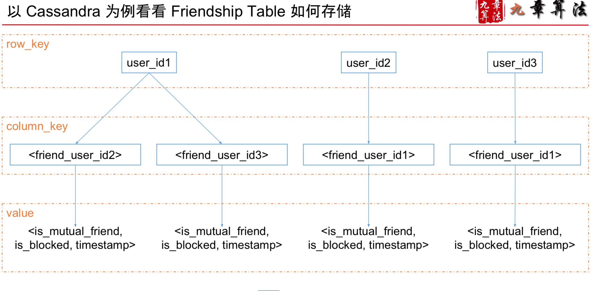

#Design User System - Database & Memcache

##用户系统
-  用户系统特点 读非常多，写非常少 一个读多写少的系统，一定要使用 Cache 进行优化

###Scenario

DAU 1M
- 注册/登陆/信息修改
```
  QPS = 1M * 0.1 / 86400 = 100
  PEAK = 100 * 3 = 300
```
- 用户信息查询
```
  QPS = 1M * 100 / 86400 = 100K
  PEAK = 100K * 3 = 300K
```

###Service
####Authentication Service

- Session Table 存在哪儿? 一般来说，都可以，即便存在 Cache 里,断电了相当于让所有用户都 logout 也没啥大不了 存在数据库里肯定更好 如果访问多的话，就用 Cache 做优化即可

####FriendShip Service


#####FriendShip Service 如何选择数据库
- 数据库选择原则1 大部分的情况，用SQL也好，用NoSQL也好，都是可以的
- 数据库选择原则2 需要支持 Transaction 的话不能选 NoSQL
- 数据库选择原则3 你想不想偷懒很大程度决定了选什么数据库, SQL更成熟帮你做了很多事儿 NoSQL很多事儿都要亲力亲为(Serialization, Secondary Index)
- 数据库选择原则4 如果想省点服务器获得更高的性能，NoSQL就更好 硬盘型的NoSQL比SQL一般都要快10倍以上




###Storage
- Cache 只是个概念
-  Memcached 一款负责帮你Cache在内存里的“软件” 非常广泛使用的数据存储系统


- 对于 User System 而言, 写很少, 读很多
  * 写操作很少，意味着
  * 从QPS的角度来说，一台 MySQL 就可以搞定了 • 读操作很多，意味着
  * 可以使用 Memcached 进行读操作优化
- 进一步的问题，如果读写操作都很多，怎么办?
  * 方法一:使用更多的数据库服务器分摊流量
  * 方法二:使用像 Redis 这样的读写操作都很快的 Cache-through 型 Database
  * Memcached 是一个 Cache-aside 型的 Database，Client 需要自己负责管理 Cache-miss 时数据的 loading


####Scale
- 100M 的用户存在一台 MySQL 数据库里也存得下，Storage没问题,通过 Cache 优化读操作后，只有 300QPS 的写，QPS也没问题 还有什么问题?
- Single Point Failure 万一这一台数据库挂了 短暂的挂:网站就不可用了 彻底的挂:数据就全丢了

#####接下来两件事情
- 数据拆分 Sharding
  * 按照一定的规则，将数据拆分成不同的部分，保存在不同的机器上 • 这样就算挂也不会导致网站 100% 不可用
  * 数据备份 Replica
  * 通常的做法是一式三份(重要的事情“写”三遍) • Replica 同时还能分摊读请求

#####Sharding 数据的分发规则
- SQL自身不带 Sharding 功能，需要码农亲自上手 Cassandra为例的NoSQL大多数都自带 Sharding

#####Replica
