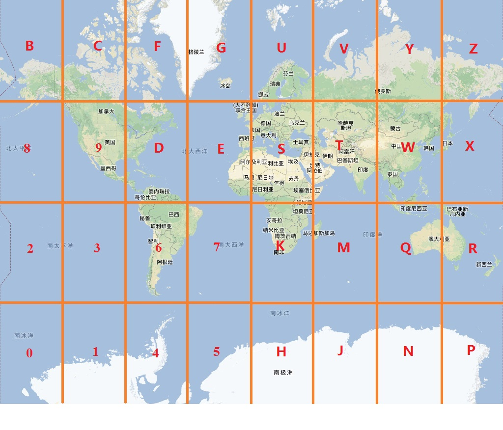

##GeoHash
[lintcode](https://www.lintcode.com/problem/geohash/description)

##Description

	Geohash is a hash function that convert a location coordinate pair into a base32 string.

	Check how to generate geohash on wiki: Geohash or just google it for more details.

	Try http://geohash.co/.

	You task is converting a (latitude, longitude) pair into a geohash string.

##Example
Given lat = 39.92816697, lng = 116.38954991 and precision = 12 which indicate how long the hash string should be. You should return wx4g0s8q3jf9.

The precision is between 1 ~ 12.

##Note


##思路
- 读懂上图
- 利用二分法,一步步找范围,如果经度<0一定在左边,纬度<0一定在下边,每次分成四个块
- 所以对于我们geohash32块,要进行找5次四个块,才能精确确定到32块中的一个
- 经度是纬度的两倍,先从经度走,然后范围/2


```java

public class GeoHash {

    String base32 = "0123456789bcdefghjkmnpqrstuvwxyz";
    double lonMax = 180;
    double lonMin = -180;
    double latMax = 90;
    double latMin = -90;
    /*
     * @param latitude: one of a location coordinate pair
     * @param longitude: one of a location coordinate pair
     * @param precision: an integer between 1 to 12
     * @return: a base32 string
     */
    public String encode(double latitude, double longitude, int precision) {
        // write your code here
        if (latitude > latMax || latitude < latMin || longitude > lonMax || longitude < lonMin) {
            return new String("Error");
        }

        if (precision > 12 || precision < 1) {
            return new String("Error");
        }

        StringBuilder result = new StringBuilder();
        int divideTimes = 0;
        int index = 0;
        boolean divideLon = true;

        while (result.length() < precision) {
            if (divideLon) {
                double lonMid = (lonMax + lonMin) / 2;
                if (longitude <= lonMid) {
                    index = index * 2;
                    lonMax = lonMid;
                } else {
                    index = index * 2 + 1;
                    lonMin = lonMid;
                }

            } else {
                double latMid = (latMax + latMin) / 2;
                if (latitude <= latMid) {
                    index = index * 2;
                    latMax = latMid;
                } else {
                    index = index * 2 + 1;
                    latMin = latMid;
                }
            }
            divideLon = !divideLon;

            if (++divideTimes == 5) {
                result.append(base32.charAt(index));
                index = 0;
                divideTimes = 0;
                //divideLon = true;
            }
        }

        return result.toString();
    }
}

```
